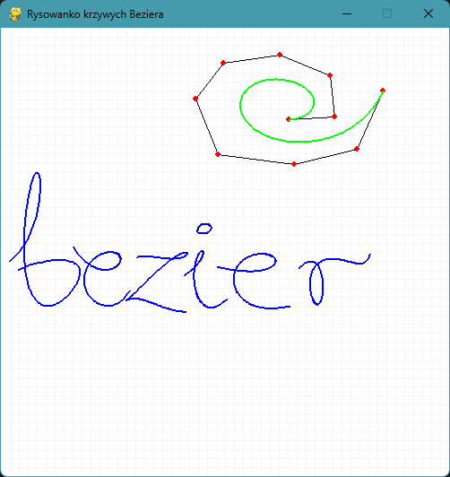

Here is a sample README file for your Bezier Curve Simulator project, formatted in Markdown for GitHub:

---

# Bezier Curve Simulator

  
A graphical simulator for creating and visualizing Bezier curves. This project allows users to draw, manipulate, and interact with Bezier curves in real time using Python and Pygame.

---

## Features

- **Dynamic Curve Drawing**: Create and visualize Bezier curves with adjustable control points.  
- **Interactive Controls**:
  - Add, drag, or remove control points dynamically.
  - Switch between multiple Bezier curves.
  - Toggle control lines and points on/off.
- **Grid System**: Helps in precise placement of control points.  
- **Save as Image**: Export your drawing as a `.png` file.  

---

## Installation

1. Clone this repository:
   ```bash
   git clone https://github.com/iwbdts/bezier-curve-simulator.git
   cd bezier-curve-simulator
   ```

2. Install the required dependencies:
   ```bash
   pip install pygame
   ```

3. Run the application:
   ```bash
   python bezier_curves.py
   ```

---

## How to Use

### Mouse Controls:
- **Left Click**: Add a new control point to the active curve.
- **Drag Points**: Click and hold on an existing control point to move it.

### Keyboard Controls:
| Key   | Action                                         |
|-------|-----------------------------------------------|
| `S`   | Save the current drawing as a `.png` file.    |
| `D`   | Delete the last control point.                |
| `W`   | Switch to the next curve.                     |
| `Q`   | Switch to the previous curve.                 |
| `N`   | Create a new Bezier curve.                    |
| `L`   | Toggle control lines visibility.              |
| `P`   | Toggle control points visibility.             |

---

## Example Output

Here's a simple example of a drawn Bezier curve with control lines and points visible:  



